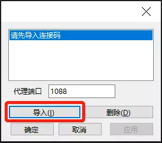
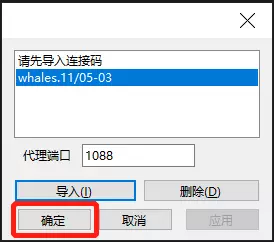
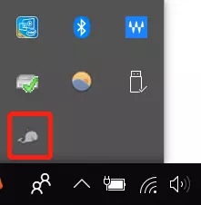
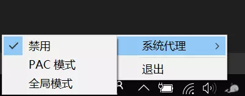

### 关于如何使用白鲸Windows版
#### 1.首先先[下载Windows版][1]压缩包
#### 2.解压文件到本地后打开Whales目录，双击"Whales.exe"运行软件
#### 3.打开白鲸Android App,点击发现按钮，点击列表中的"获取连接码"按钮
成功获取后，连接码会复制到您的粘贴板

#### 4.将连接码发送到Windows电脑，点击Windows端"Whales.exe"页面中的"导入"按钮

#### 5.成功导入后，软件页面的列表框中会添加"Whales-xx-xx:xx"选项，选中该项后点击"确定"按钮

#### 6.在Windows右侧任务栏中找到"whales"图标，鼠标移动到该图标上后点击右键-系统代理
其中"禁用"项为关闭代理，"PAC模式"和"全局模式"为打开代理

#### 使用完毕后点击退出按钮即可

[1]: https://raw.githubusercontent.com/vpn-whales/whales/master/whales-windows/Whales.rar